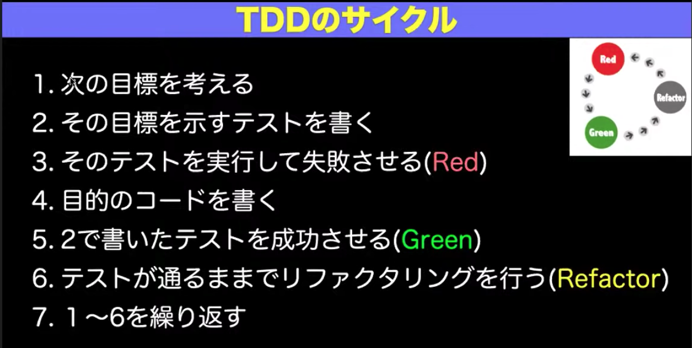

# TDD（テスト駆動開発）でコードを書いてみる

## 課題内容

[airtable](https://airtable.com/tblTnXBXFOYJ0J7lZ/viwyi8muFtWUlhNKG/recjXEpChElr4AzCd?blocks=hide)

---

## 課題 1(質問)

TDD のゴールは、**動作するきれいなコード**。

### 1. メリデメ

- メリット
  - 開発が予測可能になる。完成したかどうかがわかり、バグが残っているかを心配する必要がない。
  - 他の人が書いたコードも信頼できる
  - 自分たちでテストを書くようになる。（誰かがテストを書いてくれるのも 1 日に 20 回も待っていることなどできないから）
  - 凝縮度が高く結合度が低いたくさんのモジュールで構成された設計を行うようになる。（そのほうがテストが書きやすいから）
  - 書いていて気持ちがいい
  - 心配事が減る
  - 多くのことを一度に心配する必要がなくなる
- デメリット

  - テスト熱中症になる（かも）
    - [第 14 回　テスト厨，TDD の壁，DB や GUI のテスト](https://gihyo.jp/dev/serial/01/tdd/0014)

- 参考文献
  - [テスト駆動開発](https://tatsu-zine.com/books/test-driven-development)

### 2. TDD 用語を説明せよ

- 三点測量
  - 仮実装に対して、コードを一般化するために 2 つ目の実例を試すこと。
  - Kent Beck は三角測量の使い所としては、設計のアイデアが浮かばない時に三角測量を試してみると言っている。三角測量によって、異なる角度から問題について考える機会を与えてくれるから。
- レッド・グリーン・リファクタリング

  - プログラミングスタイル

    - レッド
      - 動作しない、おそらく最初のうちはコンパイラも通らないテストを 1 つ書く。
    - グリーン
      - そのテストを迅速に動作させる。このステップでは罪を犯してもよい。
    - リファクタリング - テストを通すために発生した重複をすべて除去する。

    

- 仮実装
  - テストコードをテストするための手法
    - 他には Defect Insertion や Mutation Testing が存在する
    - しかし、実行コストが非常に高い
  - 具体的には、ベタなコードを書いてテストを成功させる手法
    - ハードコード等のひどい茶番で、テストが成功および失敗することを確かめる
  - なぜ仮実装を行うのか
    - コードを書き始めたときが、テストコードのテストを最もしたいタイミング且つコストが低い。
    - だから、1 番最初にテストのテストを実行する。この作業を仮実装と呼ぶ。

---

## 課題 2(実装)

### Run Application

```bash
yarn install
yarn test
```

- 補足
  - [Google TypeScript Style Guide](https://google.github.io/styleguide/tsguide.html) を導入してみた
  - `npx gts init` を実行するだけで、eslint, prettier, npm scripts が自動生成されて楽だった
    - [gts | Getting Started](https://github.com/google/gts)

### 各種ファイル

- TODO ファイル
  - `<rootDir>/TODO.md`
- 実行ファイル
  - `<rootDir>/src/index.ts`
- テストファイル
  - `<rootDir>/__tests__/index.test.ts`

## 疑問

- Array.prototype.reduce() で実現しているが、引数に空配列を渡した際の実装方法が異なる。
  - 加算は initialValue を設定して対応。
  - 減算は reduce 実行前に配列の要素数を確認して対応。
  - この違いはしょうがない?
- 割り算に関して、Number 型の精度上、どうすればよかったのだろうか?
  - 1/0.000000000000003 -> 333333333333333.4 となる。
    - 理由は Double 型の制約。
    - 引数に桁数を制限すべき?
    - 出力を工夫すべき?
- describe が 3 階層なのは、やりすぎ?
